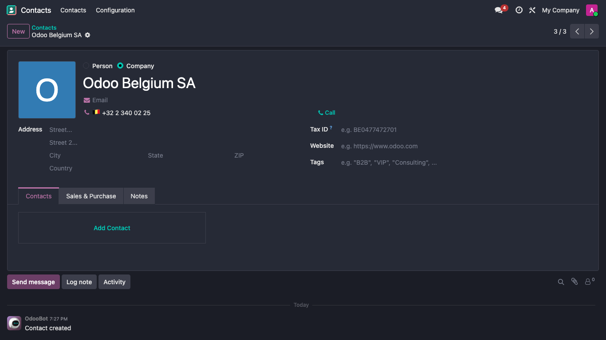

# Contacts Phone Country Flag

Show a country flag next to phone numbers on Odoo contacts.



## Overview

On the contact form, this module displays a country flag emoji right before the
phone number — for example `🇧🇪 +32 2 340 02 25`. It makes international address
books easier to scan, the way Gmail and similar tools already do.

## Features

- Detects the country from the phone number's **international prefix** using the
  [`phonenumbers`](https://pypi.org/project/phonenumbers/) library (through
  Odoo's standard `phone_validation` module).
- Falls back to the contact's **country** (`country_id`) when the number is
  stored in national format.
- Shows nothing when no country can be determined, keeping the form clean.

## How it works

The flag is exposed through a computed, non-stored `phone_country_flag` field on
`res.partner`, and rendered by a small widget that extends Odoo's standard phone
field. A few deliberate design choices keep it simple and fast:

- **No database column** — the field is computed and non-stored, so it is only
  evaluated for the records actually shown on screen.
- **No image assets, no extra queries** — the flag is a Unicode
  regional-indicator emoji derived from the ISO country code.
- **Non-intrusive** — the widget reuses the standard phone field's behaviour
  (click-to-call, edit mode); it only prepends the flag.

## Installation

1. Copy the `contacts_phone_country_flag` folder into your Odoo addons path.
2. Update the apps list and install **Contacts Phone Country Flag**.

Dependencies, both shipped with Odoo: `contacts`, `phone_validation`.

## Compatibility

- Odoo **19.0**
- Odoo **Community** and **Enterprise**

> Note: this is a custom module, so it can be installed on self-hosted or
> Odoo.sh instances. It cannot be installed on Odoo Online (SaaS).

## Testing

The module ships with automated tests:

- Python unit tests covering prefix detection, the `country_id` fallback, the
  prefix-wins-over-country rule, empty/invalid inputs, and the ISO-to-emoji
  helper.
- A browser tour that types a phone number into a new contact and asserts the
  flag is rendered.

Run them with:

```bash
odoo-bin -d <database> -i contacts_phone_country_flag \
    --test-enable --test-tags /contacts_phone_country_flag --stop-after-init
```

## Author

**much. Consulting** — <https://muchconsulting.com>

## License

[LGPL-3.0-or-later](LICENSE).
