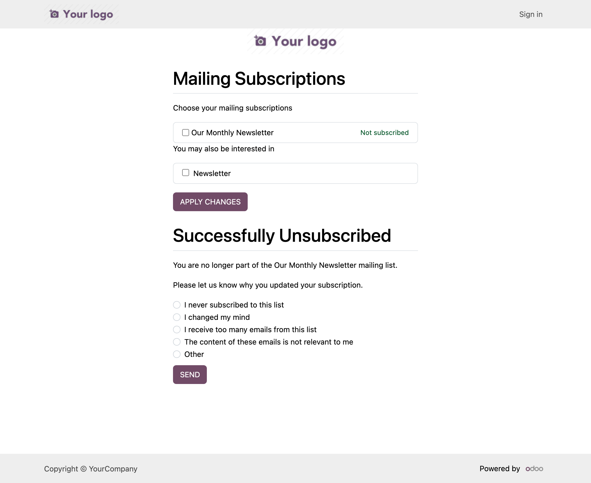

# Mailing List Public Name

Mailing lists often have descriptive internal names like *"Premium plan buyers
in the DACH region"*. By default, recipients see that exact name on the
subscription / unsubscribe page. This module lets you give each list a separate,
marketing-friendly **Public Name** that recipients see instead, while your team
keeps the internal name everywhere in the backend.

## Features
- Adds a **Public Name** field to every mailing list (visible when the list is
  set to *Show In Preferences*).
- Recipients see the public name on the subscription page, the "you may also be
  interested in" list, and every unsubscribe confirmation message.
- When the public name is left empty, the internal name is shown, so existing
  lists keep working with no change.

## How it works
- Adds `public_name` (stored) and a computed `public_name_display`
  (`public_name` falling back to `name`) on `mailing.list`.
- Overrides the `mass_mailing.unsubscribe_form` portal template and the two
  `mass_mailing` controller methods that build recipient-facing list-name
  strings, so the internal name never leaks on any public page.

## Installation
1. Drop the module into your addons-path.
2. Update the apps list and install **Mailing List Public Name**.

## Compatibility
- Odoo 19.0 (Community) — extends `mass_mailing`.
- Note: Odoo Online / SaaS does not allow custom modules — deploy on Odoo.sh or on-premise.

## Testing
Run: `odoo-bin -d <db> -i much_mailing_list_public_name --test-enable --test-tags /much_mailing_list_public_name --stop-after-init`

## Author
much. Consulting — https://muchconsulting.com

## License
LGPL-3.0 or later. See [LICENSE](LICENSE).
